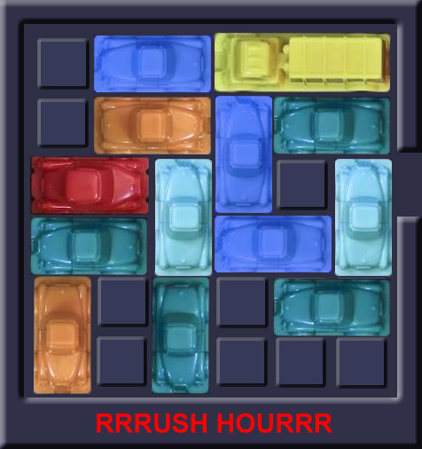

# Rush Hour

In dit project bekijken een aantal manieren voor het oplossen van verschillende configuraties van een puzzelspel genaamd "Rush-Hour".

Rush-Hour bestaat uit een 2D grid waarop auto's staan die horizontaal of verticaal kunnen schuiven.

Het doel van Rush-hour is om de rode auto naar de uitgang te navigeren doormiddel van het wegschuiven van alle andere auto's die de weg versperren.

Hoewel Rush-Hour berust op een simpel spelprincipes, kunnen bordconfiguraties al snel erg ingewikkeld worden om op te lossen. Voor dit project zijn 7 verschillende bord configuraties verstrekt die allemaal met behulp van verscheidene algoritmes zijn opgelost.




## Aan de slag


### Vereisten

Deze codebase is volledig geschreven in [Python3.6.3](https://www.python.org/downloads/). In requirements.txt staan alle benodigde packages om de code succesvol te draaien. Deze zijn gemakkelijk te installeren via pip dmv. de volgende instructie:

```
pip install -r requirements.txt
```

### Structuur

Alle Python scripts staan in de map code. Deze map bestaat uit een aantal submappen: algorithms, classes en functions. In de map algoritms staat de code voor de random algoritmes (algorithms.py), de breadthfirst search (map breadthfirst) en het backtrack algoritme (backtrack.py). De breadthfirst map bevat een eigen "structure" en "algorithm", omdat deze afwijken van de standaard structuur. De map classes bevat de structuur van een normale game: Hier wordt een nieuwe game en auto's in geinitialiseerd. Daarnaast staat hier de hoofd "Play" methode in. In de map functions staan een aantal ondersteunende bestanden zoals gamefunctions.py, wat een aantal ondersteunende functies biedt voor een game, zoals het checken van een winnende conditie of het vinden van een valide zet. Het bestand functions.py bevat algemeen ondersteunende functies zoals het maken van een string van de grid.


### Test

De code kan gedraaid worden door middel van de volgende instructie:

```
python main.py
```

In main.py kunnen er een aantal aanpassingen gedaan worden om verschillende algoritmes te testen:


#### Game grids
Allereerst kan er in main.py ingesteld worden welke game van Rushhour er wordt gespeeld. Hierin moet de volgende aanpassingen gedaan worden:
* De naam van het CSV file kan veranderd worden
* De gridsize moet aangepast worden op het moment dat er een grotere grid wordt gekozen als CSV file.


#### A: Random algoritmes
Bij random algoritmes wordt het gameboard door middel van random steps opgelost. Dit kan op een aantal verschillende manieren.  
* Allereerst kunnen alle auto's random een enkele stap doen ("single") of een maximale grootte stap doen ("max").
* Ook kan de gebruiker aan of uit zetten dat een auto die net bewogen is, niet de volgende stap terug bewogen kan worden (non recurring True of False)
* Als winconditie kan het algoritme checken of de rode auto op de juiste plek bij de uitgang staat ("win"), maar het algoritme kan ook checken of het pad naar de uitgang voor de rode auto vrij is ("check_path_free"). Tot slot is er een win conditie die checkt of het pad naar de uitgang vrij gemaakt kan worden ("make_path_free").
* Ten slotte kan het random algoritme visueel gerepresenteerd worden op het moment dat visualisation True is. (Advies: doe dit alleen bij game 1, andere games hebben een grote hoeveelheid stappen nodig om te winnen.)
Deze opties zijn allemaal individueel te veranderen in main.py.

#### B: Backtrack algoritme
Het backtrack algoritme runt een bepaald aantal games. Dit aantal is zelf aan te passen in main.py. Bij deze games worden een bepaald aantal grids (ook zelf aan te passen in main.py) opgeslagen in een dictionary. De grid zelf is hier de key. De values die de key bevat zijn de stappen die nog gedaan moeten worden om naar de endstate te komen. Vervolgens wordt er weer een bepaald aantal keer het random algoritme uitgevoerd (in te stellen in main.py). Bij het uitvoeren van deze games wordt na iedere stap gekeken of de huidige grid voorkomt in de grid dictionary. Als dit zo is, worden de moves die nog in de grid dictionary staan uitgevoerd. De volgende waardes kunnen dus aangepast worden:
* Aantal keer uitvoeren random algoritme voor het vullen van de grid dictionary.
* Aantal grids die worden toegevoegd vanaf de endstate.
* Aantal keer uitvoeren van het random algoritme voor het vergelijken met de grid dictionary.

#### C: Breadthfirst algoritme
Het breadthfirst algoritme (BFS) vindt de oplossing van een game doormiddel van het berekenen van alle mogelijke "states" van het spelbord. Een "state" is een bepaalde combinatie van hoe de autootjes op het bord staan. Het algoritme blijft nieuwe states berekenen tot dat er een oplossing gevonden is. Deze oplossing is altijd de snelste oplossing omdat het algoritme vanaf de begin opstelling begint met states berekenen. Het nadeel van dit algoritme is dat het erg veel geheugen en rekenkracht vraagt om te runnen. Hierdoor kunnen enkel de eerste 4 puzzelconfiguraties opgelost worden, binnen een praktische tijdsduur.


Er zijn twee verschillende wincondities
  - "path_free" kijkt of het pad naar de uitgang vrij is
  - "one_blocker" komt 1 stap eerder namelijk wanneer er enkel 1 auto is die de vrije doorgang blokkeert die genoeg ruimte heeft om weggeschoven te worden.

Ondanks dat de tweede win conditie meer rekenkracht per node vergt, vindt het de oplossing gemiddeld sneller omdat het 1 niveau eerder klaar is.

Er zijn twee prune mogelijkheden

- "pre" checkt voordat het een node toevoegd aan de wachtrij van BFS of de bordconfiguratie niet al eerder is doorlopen
- "post" voegt alle nodes toe aan de wachtrij, maar checkt voor duplicates als de node uit de wachtrij gehaald wordt, dit voorkomt dat dubbele kinderen in de wachtrij worden gezet.

#### State space
Een 6x6 grid bestaat uit 12 lanen, 6 horizontaal en 6 verticaal. Elke laan heeft een eigen state space. De totale state space van de hele grid is het product van alle state spaces van die lanen. Wanneer we de state space van een horizontale lijn bepalen kijken we alleen naar de horizontale auto's en niet naar de verticale auto's. Visa versa voor de verticale lanen. Zodra de state spaces van deze lanen bepaald zijn hoeft er alleen nog maar geteld te worden per grid hoeveel van welke soort lanen er aanwezig zijn. In het "state_space.py" bestand staat per laan vernoemd wat de bijbehorende state space is. De functie in dat bestand berekent de state space van een grid. Er moet handmatig ingevuld welke soorten lanen er aanwezig zijn in een bepaalde grid.

## Auteurs

* Liz Mooij
* Coen Prins
* Hiele Wilkes

## Dankwoord

* StackOverflow
* Minor programmeren van de UvA
* Onze supervisors Nigel van Herwijnen & Reitze Jansen
